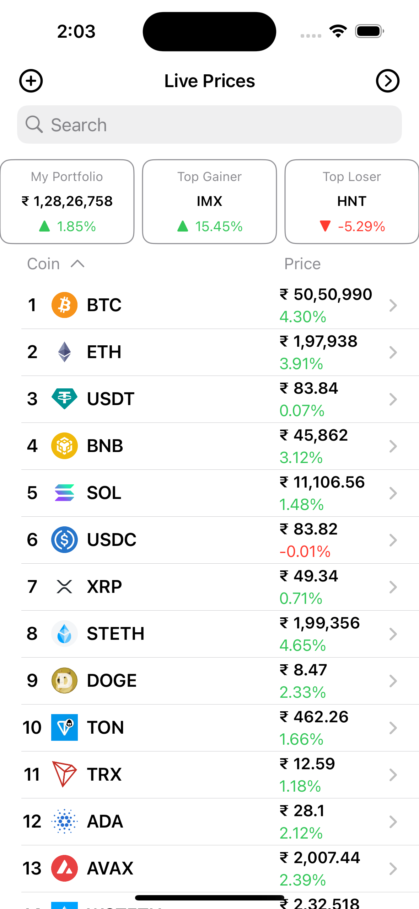
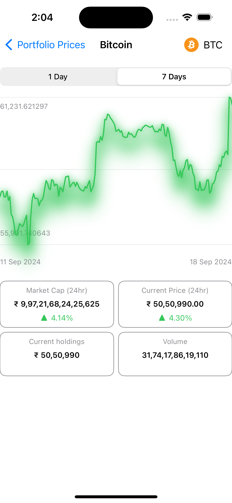
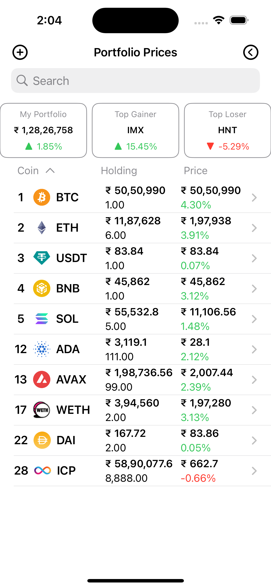
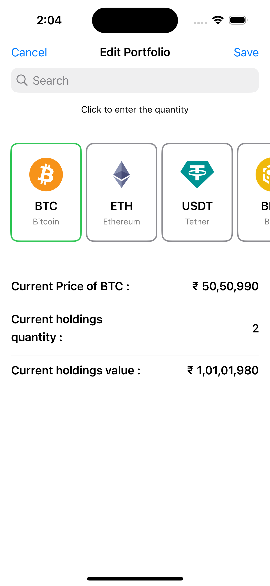

# Crypto Tracker App

This is a SwiftUI-based Crypto Tracker application that fetches and displays cryptocurrency market data from the CoinGecko API. The app uses the `Charts` framework to visualize price trends, and it follows the MVVM architecture for clean separation of logic and UI. Users can view the latest market data, track coin performance, manage their portfolio using `UserDefaults`, and filter coins based on various criteria such as market cap and price.

## Features

- **Cryptocurrency Data Fetching:** The app retrieves real-time cryptocurrency market data, including prices, market cap, volume, and more, using the CoinGecko API.
- **Charts Integration:** Visualize price trends over time using the `Charts` framework for interactive data representation.
- **Portfolio Management:** Users can add cryptocurrencies to their portfolio, and the portfolio data is stored locally using `UserDefaults`.
- **MVVM Architecture:** The app follows the MVVM pattern to separate business logic from UI, ensuring cleaner code and easier maintainability.
- **Filtering Options:** Users can filter the coins based on market cap, price, and performance.
- **Splash Screen:** The app includes a splash screen that appears when the app launches, providing a smooth transition to the main content.

## Technologies Used

- **SwiftUI** for building the user interface.
- **Charts Framework** for rendering dynamic and interactive charts.
- **CoinGecko API** for fetching live cryptocurrency data.
- **UserDefaults** for storing the user's portfolio locally.
- **MVVM Architecture** for better organization and scalability.
- **Async/Await** for handling network requests efficiently.

## Screenshots

### Coin List

### Coin Details with Chart

### Portfolio List

### Edit Portfolio 

